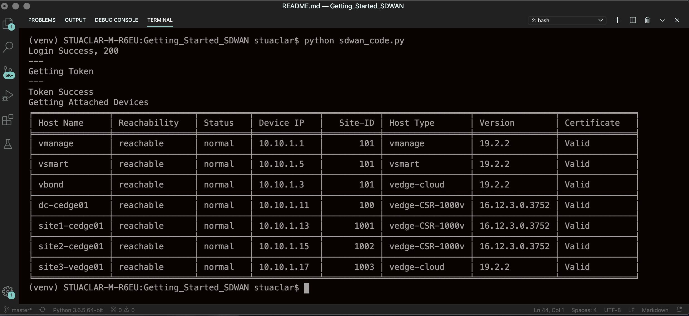

# Getting_Started_SDWAN

In Cisco SD-WAN vManage 19.2 change have been made that requires the use of a token in the headers for any API interaction to work

This public repo contains python code that can be used to interact with the `Cisco SD-WAN vManage REST API`. The environment is pre-configured to access the [Cisco DevNet Reservable Sandbox for SD-WAN](https://devnetsandbox.cisco.com/RM/Diagram/Index/c9679e49-6751-4f43-9bb4-9d7ee162b069?diagramType=Topology) fabric.You can edit the variables in the environment to point to your own vManage instance. The code contains REST API calls to authenticate, get a list of devices that are part of the SD-WAN fabric. Cisco SD-WAN vManage 19.2.2.


## Python Environment Setup
It is recommended that this code be used with Python 3.6. It is highly recommended to leverage Python Virtual Environments (venv).

Follow these steps to create and activate a venv.

## OS X or Linux
```
virtualenv venv --python=python3.6
source venv/bin/activate
```
## Install the code requirements
```
pip install -r requirements.txt
```

## API authentication Process

- Send POST request for authentication with vManage web server.
- Method: `POST`
- Request URL:  `https://vmanage-ip:vmanage/j_security_check`
- POST Request Payload: `{'j_username' : username, 'j_password' : password}`

## API authentication Process

- Once login is successful run GET request to retrieve token and add it to session headers of subsequent API calls. 
- Method: `GET`
- Request URL: `https://vmanage-ip:vmanage/dataservice/client/token`
- Store the response  token value in session headers `“sess.headers['X-XSRF-TOKEN']”`

## Getting / Printing Device Information

- Method: `GET`
- Request URL: `https://vmanage-ip:vmanage/dataservice/device`

## Example Output




## About me

Stuart is a Senior Developer Advocate, public speaker, author and DevNet Expert #2022005

Find me here: [LinkedIn](https://www.linkedin.com/in/stuarteclark/) / [Twitter](https://twitter.com/bigevilbeard) / [bigevilbeard.io](https://bigevilbeard.github.io/)

